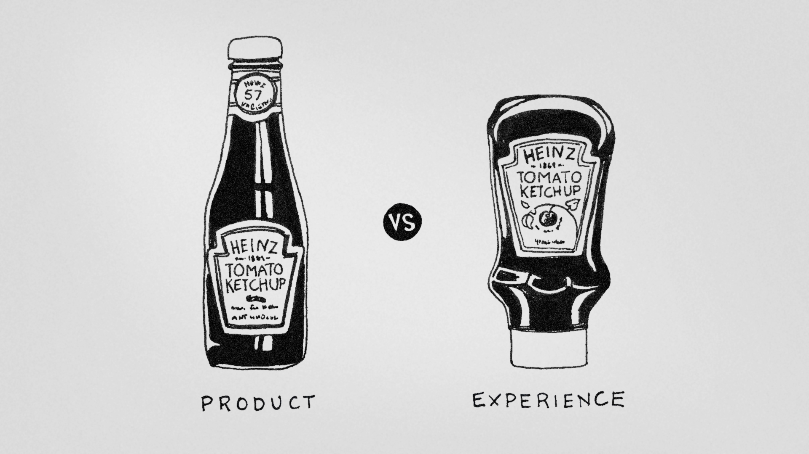

# CAS D'ECOLE DE L'UX :

## HEINZ et la bouteille de ketchup

La bouteille de ketchup en verre emblématique de Heinz était autrefois un aliment de base dans les cuisines familiales du monde entier.

Mais à la fin des années 1980, l’entreprise alimentaire géante a pris la décision de changer de façon monumentale la conception de ses emballages. La motivation derrière ce changement en dit long sur l’importance de la recherche sur les besoins des utilisateurs et en particulier sur l'importance de l'UX dans un produit.

### Design classique

Heinz a introduit le ketchup à la tomate dans sa gamme de produits en 1876. Il s'agissait de l'une des premières offres de la société. L'emballage de ketchup est resté pratiquement le même pendant plus d'un siècle, mis à part les petites améliorations apportées à la conception des bouteilles en verre.

Cependant, Heinz était dans une quête pour comprendre comment les gens consommaient leur produit. Ils ont chargé des chercheurs de se rendre dans les maisons familiales américaines et d'observer ce que maman, papa et les enfants faisaient lorsqu'ils se réunisaient autour de la table. Ce qu'ils ont vu ensuite leur a permis de mieux comprendre leurs clients, probablement bien au-delà de leurs attentes.

Comme beaucoup d’entre nous l’ont connu, sortir du ketchup d’une bouteille en verre est certainement un moyen de donner une séance d’entraînement aux biceps. La première étape consiste à retourner la bouteille et de la tenir dans une main. La deuxième étape consiste à frapper vigoureusement le bout de celui-ci avec l’autre main pour faire bouger le ketchup et le faire ressortir sur la plaque.

Les chercheurs ont pu observer que la difficulté du à faire sortir le ketchup lorque la bouteille était presque fini faisait qu'au final sont utilisation était strictement réservé aux adultes.

Ce fut un moment de vérité pour les chercheurs et, par extension, pour Heinz. Un enfant de cinq ans typique consomme environ 60% de ketchup de plus qu'un homme de 40 ans. 

La société a compris qu’elle avait besoin de mettre du ketchup dans une bouteille que les jeunes pourraient contrôler eux-mêmes. Sinon, le pouvoir parental limiterait toujours les niveaux de consommation.

L'équipe de conception des emballages s'est donc concentrée sur la résolution de ce problème et l'amélioration de la convivialité. Ils ont imaginé le flacon EZ Squirt en plastique souple avec une buse conique. C'était beaucoup plus léger pour tout le monde, surtout les enfants, et le ketchup sortait avec beaucoup moins d'effort.

Les premières recherches ont montré que, dans les foyers où la bouteille EZ Squirt était utilisée, la consommation de ketchup avait augmenté de 12%. Au fil du temps, le public a privilégié les versions de bouteilles en plastique par rapport aux bouteilles en verre et Heinz a cessé de fabriquer la bouteille en verre pour la consommation domestique.

Il figure toujours dans de nombreux restaurants et a été réintroduit en tant que produit nostalgique en édition limitée dans les épiceries américaines en 2011.
Continuez à observer vos utilisateurs

Avant de passer à ce que cette histoire a à nous dire sur le design UX, laissez-nous juste une petite note sur ce que Heinz a ensuite fait. En tant qu'entreprise renommée pour ses innovations en matière d'emballage, il n'est pas surprenant qu'elle ait continué à réinventer sa bouteille de ketchup sur la base d'informations fournies par les recherches des utilisateurs.

À la fin des années 90, les ventes de condiments étaient en baisse et l'entreprise souhaitait savoir si cela avait un lien avec les expériences d'utilisation du produit par les gens. Les recherches effectuées auprès des utilisateurs ont révélé que les gens avaient toujours du mal à extraire le ketchup de la bouteille en plastique.

Ils ont souvent trop peu de ketchup, mais ils se contentent de faire ce qu’ils ont au lieu de continuer à presser. Et des morceaux de ketchup s'accumulaient autour de la buse, ce qui était un peu une tâche compliquée. Pour lutter contre ces problèmes, les gens stockaient souvent leurs bouteilles de Heinz à l’envers dans le réfrigérateur ou le garde-manger.

L'équipe Heinz a donc pris connaissance de la situation de l'utilisateur et a littéralement inversé le problème. La bouteille de ketchup à l'envers était née - elle aidait les consommateurs à obtenir le produit plus rapidement et avec moins de gâchis à l'ouverture de la bouteille (une nouvelle invention sur les vannes a également aidé - consultez cet article sur son inventeur Paul Brown ). 

